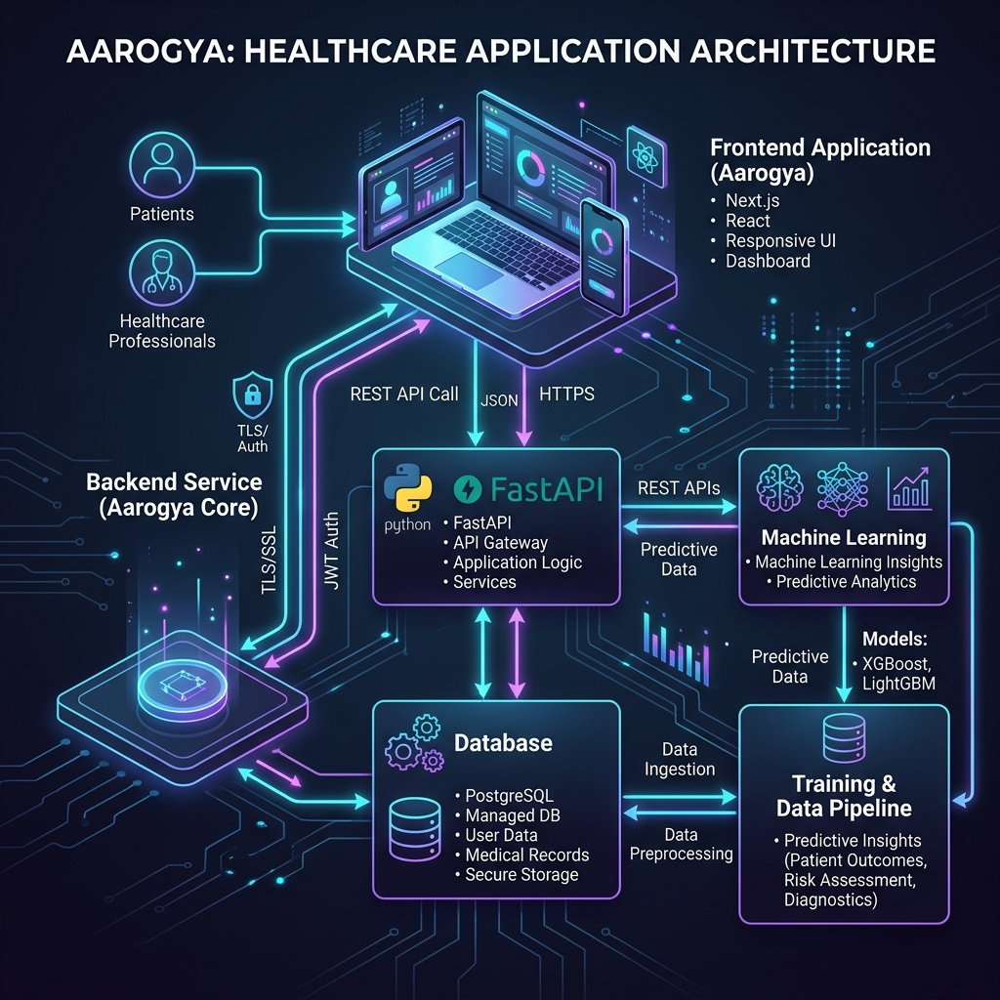

# Aarogya — Next-Generation Healthcare Management Platform 🏥

> A comprehensive, full-stack healthcare management system designed for India's Primary Health Centres (PHCs) and Community Health Centres (CHCs). Aarogya unifies clinical administration, real-time staff attendance, predictive inventory management, and AI-powered patient insights under a single, beautiful dashboard — extensively powered by the **Google Cloud ecosystem**.



---

## 🌟 Google Technologies at the Core

Aarogya deeply integrates multiple Google technologies to deliver intelligent, scalable healthcare management:

| Technology | Usage |
|---|---|
| **Google Gemini AI** (`gemini-2.5-flash`) | Powers inventory insights engine, analytics AI summarization, and NLP chat intent processing |
| **Google Cloud Translate API** | Translates medical prescriptions and patient instructions into regional languages |
| **Google Maps API** (`@react-google-maps/api`) | Interactive geospatial maps of all PHCs/CHCs across the district |
| **Google Calendar API** | Integrated into the Doctor dashboard for scheduling and attendance cross-referencing |
| **Gmail SMTP** | Automated onboarding emails sent to newly registered Health Centre admins |

### Gemini AI in Action

The backend uses `google-genai` SDK with Gemini 2.5 Flash for three distinct AI pipelines:

**Inventory Insights** — Analyzes current stock for every item, identifies anomalies, and produces actionable recommendations:
```python
# backend/app/services/gemini_service.py
from google import genai

client = genai.Client(api_key=settings.GEMINI_API_KEY)
response = client.models.generate_content(
    model='gemini-2.5-flash',
    contents=prompt,
)
```

**Analytics AI** — Interprets operational KPIs (patient footfall, bed occupancy, staff absence), identifies risks by severity, and generates an executive summary for Medical Officers:
```python
def get_analytics_insights(analytics_data: dict, period_type: str) -> str:
    # Returns JSON with executive_summary, key_insights, risks[], recommendations[]
```

**Resource Redistribution Engine** — Recommends Cross-District or intra-district inventory transfers to balance surpluses and prevent stockouts across the region.

---

## 🌍 BRICS Federated Health Resilience Platform

Aarogya supports multi-nation deployments through its BRICS Federation Layer, enabling countries to operate on a unified platform while maintaining strict data sovereignty.

- **Federated Learning (FedAvg) Aggregator:** A standalone FastAPI aggregator (`backend/federation-aggregator/main.py`) collects local ML model updates (coefficients, intercepts) from participating BRICS nations without ever touching their raw patient or inventory data. It performs Federated Averaging (FedAvg) to build a robust global model.
- **Global Resilience Dashboard:** The `FederationDashboard` provides real-time visibility into active nodes, categories trained, and local vs. global model performance (MAE) improvements.
- **Data Scoping & Strict Constraints:** Core models are scoped by `nation_id`. The Groq SQL chatbot injects mandatory `nation_id` filters into all Virtual Tables, ensuring that even a `NATION_ADMIN` can only query data belonging to their own country.
- **Cross-Border Prevention:** The AI Redistribution Engine and Manual Resource Requests strictly filter donor PHC candidates to ensure they reside in the same nation, preventing illegal cross-border medical transfers.

---

## 📐 System Architecture

```
┌───────────────────────────────────────────────────────────────────┐
│                         FRONTEND (Next.js 14)                     │
│  Pages: Dashboard · Health Centres · Inventory · Forecasting ·   │
│  Attendance · Patients · Beds · Analytics · Reports · Roles       │
│  Stack: React 19 · TailwindCSS 4 · Shadcn UI · Recharts          │
└────────────────────────┬──────────────────────────────────────────┘
                         │ REST API (JSON/HTTPS)
                         ▼
┌───────────────────────────────────────────────────────────────────┐
│                       BACKEND (FastAPI)                           │
│                                                                   │
│  Routes: auth · users · phc · patients · beds · inventory ·      │
│  attendance · district · analytics · translate · chat · ml       │
│                                                                   │
│  Services: Gemini AI · Google Translate · Google Calendar ·      │
│  NLP Chat · Groq SQL · PDF Generator · Email · Health Score      │
│                                                                   │
│  Scheduler: APScheduler — Random Attendance Checks, Weekly ML    │
└──────────────┬────────────────────────────┬───────────────────────┘
               │                            │
               ▼                            ▼
┌──────────────────────┐       ┌────────────────────────────────────┐
│  PostgreSQL (Neon)   │       │   ML Models (XGBoost + LightGBM)   │
│  SQLAlchemy ORM      │       │   backend/ml_models/*.pkl           │
│  Alembic Migrations  │       │   Demand Forecasting Pipeline       │
└──────────────────────┘       └────────────────────────────────────┘
```

---

## 🗂️ Repository Structure

```
Codeamble Aarogya/
├── backend/
│   ├── app/
│   │   ├── api/
│   │   │   ├── dependencies.py          # JWT auth, role guards, hospital resolver
│   │   │   └── routes/
│   │   │       ├── auth_routes.py       # Login, refresh token, logout
│   │   │       ├── user_routes.py       # User CRUD, role management
│   │   │       ├── phc_routes.py        # Health Centre listing, filters, health score
│   │   │       ├── patient_routes.py    # Patient CRUD, ABHA lookup, timeline, analytics
│   │   │       ├── bed_routes.py        # Bed management, patient assignment
│   │   │       ├── inventory_routes.py  # Stock CRUD, dispense, restock, CSV import
│   │   │       ├── attendance_routes.py # QR sessions, scan, random checks, dashboard
│   │   │       ├── district_routes.py   # District overview, map data, resource requests
│   │   │       ├── analytics_routes.py  # KPI dashboard, Gemini AI insights, reports
│   │   │       ├── translate_routes.py  # Google Cloud Translate endpoint
│   │   │       ├── chat_routes.py       # NLP/Groq chatbot, PDF report generation
│   │   │       ├── ml_routes.py         # XGBoost/LightGBM demand forecasting
│   │   │       └── notification_routes.py # User notifications
│   │   ├── models/
│   │   │   ├── user.py                  # User, RefreshToken, UserRole enum
│   │   │   ├── patient.py               # Patient, PatientAuditLog
│   │   │   ├── health_centre.py         # HealthCentre with GPS coordinates
│   │   │   ├── inventory.py             # InventoryItem, InventoryLog, ForecastCache
│   │   │   ├── attendance.py            # DailyQRSession, AttendanceRecord, Doctor
│   │   │   ├── bed.py                   # Bed with patient linkage
│   │   │   ├── district.py              # ResourceRequest with urgency levels
│   │   │   ├── notification.py          # In-app Notification
│   │   │   └── report.py                # Generated PDF Reports
│   │   ├── services/
│   │   │   ├── gemini_service.py        # Google Gemini AI (inventory + analytics)
│   │   │   ├── chat_nlp.py              # NLP intent parser (ABHA, medicines, beds)
│   │   │   ├── chat_groq_sql.py         # Groq LLM → safe read-only SQL generator
│   │   │   ├── chat_query.py            # Controlled query executor
│   │   │   ├── chat_pdf.py              # Chat session → PDF report
│   │   │   ├── health_score.py          # Composite PHC health score algorithm
│   │   │   ├── pdf_generator.py         # Analytics and inventory PDF reports
│   │   │   └── email_service.py         # Gmail SMTP onboarding emails
│   │   ├── core/
│   │   │   ├── config.py                # Pydantic settings
│   │   │   ├── security.py              # JWT, bcrypt password hashing
│   │   │   ├── scheduler.py             # APScheduler: random checks + weekly ML
│   │   │   └── rate_limit.py            # slowapi rate limiter
│   │   └── main.py                      # FastAPI app, CORS, lifespan, route registration
│   ├── ml_models/
│   │   ├── xgboost_model.pkl            # XGBoost trained demand forecasting model
│   │   └── lightgbm_model.pkl           # LightGBM trained demand forecasting model
│   ├── alembic/                         # Database schema migration files
│   └── requirements.txt
│
└── frontend/
    ├── src/
    │   ├── app/                         # Next.js App Router pages
    │   │   ├── district-admin/          # District Admin overview + map + patient search
    │   │   ├── health-centre/           # PHC/CHC listing with advanced filters
    │   │   ├── inventory/               # Inventory management + Gemini AI insights
    │   │   ├── forecasting/             # ML demand forecasting dashboard
    │   │   ├── attendance/              # QR Generator + Staff Dashboard
    │   │   ├── patients/                # Patient records + ABHA profile drawer
    │   │   ├── beds/                    # Bed management + patient assignment
    │   │   ├── analytics/               # Analytics KPIs + Gemini AI summaries
    │   │   ├── ai-audit/                # AI Audit log viewer
    │   │   ├── manage-roles/            # User & staff management
    │   │   ├── reports/                 # PDF report history
    │   │   └── login/                   # JWT-based login page
    │   ├── components/
    │   │   ├── layout/
    │   │   │   ├── Sidebar.tsx          # Collapsible, role-filtered nav
    │   │   │   ├── Header.tsx           # PHC selector, dark mode, notifications
    │   │   │   └── ClientLayout.tsx     # Auth guard + layout shell
    │   │   ├── attendance/
    │   │   │   ├── MODashboard.tsx      # Live staff attendance table + refresh
    │   │   │   ├── QRGenerator.tsx      # GPS-encoded QR code generator
    │   │   │   ├── QRScanner.tsx        # html5-qrcode scanner with lifecycle mgmt
    │   │   │   └── StaffDashboard.tsx   # Individual staff attendance history
    │   │   ├── patients/
    │   │   │   ├── PatientProfileDrawer.tsx  # Full ABHA patient profile panel
    │   │   │   └── PatientForm.tsx           # Patient registration form
    │   │   ├── inventory/               # Inventory table + stock alert cards
    │   │   ├── beds/                    # Bed grid view + assignment modal
    │   │   ├── chat/                    # Chatbot panel component
    │   │   ├── MapComponent.tsx         # Google Maps react component
    │   │   └── ui/                      # Shadcn UI primitives
    │   ├── contexts/
    │   │   ├── AuthContext.tsx           # Global auth state + JWT management
    │   │   └── LanguageContext.tsx       # i18n language switcher
    │   └── lib/
    │       ├── api.ts                   # Authenticated fetch wrapper
    │       └── permissions.ts           # Centralized RBAC route-permission map
```

---

## 🔐 Role-Based Access Control (RBAC)

Aarogya implements a **dual-layer RBAC system** — enforced independently on both the frontend and backend.

### Defined Roles

| Role | Description |
|---|---|
| `DISTRICT_ADMIN` | Full system access — all PHCs, district overview, resource requests |
| `MEDICAL_OFFICER` | PHC-scoped access — manages staff, inventory, patients, analytics |
| `DOCTOR` | Personal attendance, assigned patients, prescriptions, Google Calendar |
| `PHARMACIST` | Inventory management, dispense medicines, view forecasts |
| `RECEPTIONIST` | Patient registration, bed allocation, QR attendance scan |
| `DATA_ENTRY` | Inventory updates and patient data entry |
| `LAB_TECHNICIAN` | Attendance tracking |
| `DEVELOPER` | Unrestricted access to all routes and features |

### Frontend Route Guard

The centralized `permissions.ts` file defines which roles can access each page. The `Sidebar` auto-filters navigation links based on the authenticated user's role:

```typescript
// frontend/src/lib/permissions.ts
export const ROUTE_PERMISSIONS: Record<string, string[]> = {
  "/district-admin": ["DISTRICT_ADMIN", "DEVELOPER"],
  "/health-centre":  ["DISTRICT_ADMIN", "DEVELOPER"],
  "/inventory":      ["DISTRICT_ADMIN", "MEDICAL_OFFICER", "DATA_ENTRY", "RECEPTIONIST", "PHARMACIST", "DEVELOPER"],
  "/forecasting":    ["DISTRICT_ADMIN", "MEDICAL_OFFICER", "DEVELOPER"],
  "/attendance":     ["DISTRICT_ADMIN", "MEDICAL_OFFICER", "DOCTOR", "RECEPTIONIST", "PHARMACIST", "DATA_ENTRY", "LAB_TECHNICIAN", "DEVELOPER"],
  "/patients":       ["DISTRICT_ADMIN", "MEDICAL_OFFICER", "DATA_ENTRY", "RECEPTIONIST", "DOCTOR", "DEVELOPER"],
  "/beds":           ["DISTRICT_ADMIN", "MEDICAL_OFFICER", "DATA_ENTRY", "RECEPTIONIST", "DEVELOPER"],
  "/analytics":      ["DISTRICT_ADMIN", "MEDICAL_OFFICER", "DEVELOPER"],
};
```

### Backend Route Guard

Each FastAPI route is protected by a `require_role` dependency:
```python
# Example: Only Medical Officers and District Admins can generate QR sessions
@router.post("/qr/generate")
def generate_qr_session(
    current_user: User = Depends(require_role([UserRole.MEDICAL_OFFICER, UserRole.RECEPTIONIST]))
):
```

### Role-Based Home Redirect

After login, each user is automatically redirected to their relevant home page:
```typescript
export const ROLE_HOME: Record<string, string> = {
  DISTRICT_ADMIN:  "/district-admin",
  MEDICAL_OFFICER: "/inventory",
  DOCTOR:          "/attendance",
  PHARMACIST:      "/inventory",
  RECEPTIONIST:    "/patients",
};
```

---

## 🧭 Navigation Structure (Sidebar)

The sidebar is dynamically rendered based on the user's role. All items below are visible only to roles that have explicit permission.

| Nav Item | Route | Description |
|---|---|---|
| **Dashboard** | `/district-admin` | District-wide overview with KPI cards and live map |
| **Health Centres** | `/health-centre` | List and filter all PHCs/CHCs with health scores |
| **Inventory** | `/inventory` | Full stock management with Gemini AI insights |
| **Forecasting** | `/forecasting` | ML-powered 7-day demand forecasting per medicine |
| **Attendance** | `/attendance` | QR check-in system + staff attendance management |
| **Patients** | `/patients` | Patient records, ABHA profile lookup, discharge flow |
| **Beds** | `/beds` | Real-time bed occupancy and patient assignment |
| **Analytics** | `/analytics` | KPI charts with AI-generated executive summaries |
| **Manage Roles** | `/manage-roles` | Create, view, and manage staff accounts |

---

## 🆔 ABHA ID — Patient Identity & History

Aarogya implements **ABHA (Ayushman Bharat Health Account) ID** integration for patient identification and history lookup.

### How It Works
- Every patient is assigned a unique `patient_code` that can map to their ABHA ID
- The **Patient Profile Drawer** supports lookup via ABHA ID, patient code (`PT-XXXXXX`), or name
- The chatbot NLP system recognizes ABHA patterns using a regex matcher:
  ```python
  PATIENT_ID_RE = re.compile(r"\b(?:ABHA[-_]?[A-Z0-9]+|PT-\d{1,12}|[A-Z]{2,10}\d{3,20})\b", re.IGNORECASE)
  ```

### Patient Profile Drawer
Clicking any patient opens a rich side panel containing:
- **Demographics:** Name, age, gender, DOB, contact, address
- **Medical History:** Full text medical history field
- **Activity Timeline:** Chronological audit log of all interactions (admissions, discharges, medicine dispensing, record views)
- **Medication History:** All medicines dispensed for this patient from inventory logs
- **Inline Editing:** Update phone, gender, and DOB without leaving the panel
- **PDF Export:** Generate and download a complete patient summary as PDF

---

## 📦 Inventory Management & Early Stockout Warnings

### Smart Stock Monitoring

Every `InventoryItem` in the database has a `min_threshold` field. The system continuously monitors stock levels and assigns status flags:

| Status | Condition |
|---|---|
| `Normal` | Quantity above minimum threshold |
| `Low Stock` | Quantity at or below minimum threshold |
| `Expired` | Expiry date is in the past |

### Gemini AI Inventory Insights

Users can trigger an **AI-powered inventory analysis** that sends the complete stock data to **Google Gemini 2.5 Flash**, which returns:
- Per-medicine analysis with run rate and restock urgency
- District-wide risk factors
- Actionable recommendations for the pharmacist or MO

### Resource Requests (Cross-PHC) & Redistribution

When a PHC is critically low on resources, staff can raise a **Resource Request** that gets escalated to the District Admin. Urgency levels: `LOW / MEDIUM / HIGH / CRITICAL`.

**AI-Assisted Redistribution:** The District Admin dashboard features an AI engine that suggests optimal cross-district or intra-district transfers. When an admin approves a transfer, the system automatically finds the **Top 5 Donor Candidates** (PHCs within the same nation with the highest surplus) and allows the admin to select one. 

**Actionable Notifications:** The selected Donor PHC receives an actionable notification to "Ship Meds". If they reject it, the District Admin is notified. If they approve, the requesting PHC receives a notification to "Mark Received", thus completing the fully audited supply chain loop.

### Inventory Log Audit Trail
Every stock change (RESTOCK / DISPENSE / EXPIRED) is logged with:
- User who performed the action
- Timestamp
- Patient ID (if a dispensing event)
- Change amount and reason

### Bulk CSV Import
Pharmacists can bulk-upload inventory items from a CSV file (up to 50MB / 1000 rows). The system includes CSV injection prevention to sanitize uploaded data.

---

## 🤖 ML-Powered Demand Forecasting

### How the Forecasting Pipeline Works

The system uses an **ensemble model (XGBoost + LightGBM)** to forecast demand for every medicine at a given hospital over the next 7 days.

#### Feature Engineering

For each prediction step, the following time-series features are constructed:
```python
features = pd.DataFrame([{
    'day_of_week':      current_date.weekday(),
    'is_weekend':       1 if day_of_week >= 5 else 0,
    'demand_lag_1':     history_demand[-1],
    'demand_lag_2':     history_demand[-2],
    'demand_lag_3':     history_demand[-3],
    'demand_lag_7':     history_demand[-7],
    'demand_lag_14':    history_demand[-14],
    'rolling_mean_7':   sum(history_demand[-7:]) / 7,
    'footfall_lag_1':   history_footfall[-1],
}])
```

#### Ensemble Prediction
Both models are averaged to produce a final prediction:
```python
pred_xgb = max(0, float(XGB_MODEL.predict(features)[0]))
pred_lgb = max(0, float(LGB_MODEL.predict(features)[0]))
pred_demand = (pred_xgb + pred_lgb) / 2
```

#### Risk Classification
```
Total predicted demand > current stock        → 🔴 Critical (Stockout Expected)
Total predicted demand > 70% of current stock → 🟡 High
Otherwise                                     → 🟢 Low
```

#### Automated Scheduling
The APScheduler runs ML forecasting every **Sunday at midnight** for all hospitals:
```python
scheduler.add_job(run_weekly_ml_forecasting, "cron", day_of_week="sun", hour=0, minute=0)
```

#### Forecast Cache
Results are cached in the `forecast_cache` table (PostgreSQL JSON column) for instant dashboard loading. Admins can also manually re-trigger forecasting via a button.

---

## 📡 QR Code Attendance System

Aarogya's attendance system replaces manual registers with a secure, GPS-verified QR-based system.

### Workflow

```
1. MO / Receptionist opens QR Generator
       ↓
2. System generates a Daily QR Session with GPS coordinates of the clinic
       ↓
3. Staff member opens Attendance page → scans QR code using their phone
       ↓
4. Backend verifies:
   - Token validity (matches today's session)
   - GPS proximity (Haversine formula, checks distance from clinic)
   ↓
5. AttendanceRecord is created with timestamp + "MOBILE_APP" scanned_via flag
       ↓
6. For DOCTOR role: Random Re-verification check is scheduled
```

### GPS Geofencing
The backend uses the Haversine formula to verify that the scanning device is physically within a reasonable distance of the registered clinic location:
```python
def haversine(lat1, lon1, lat2, lon2):
    R = 6371000  # Radius of earth in meters
    # ... spherical trigonometry ...
```

### Random Re-Verification (Anti-Proxy)
After a doctor's initial check-in, the **APScheduler** schedules a surprise re-verification within 1–4 hours. The doctor receives an in-app notification requiring them to scan a live QR within **2 minutes**. Failure results in automatic attendance revocation:

```python
def schedule_random_check(doctor_id: int, session_id: int):
    delay_minutes = random.randint(60, 240)
    run_time = datetime.now(timezone.utc) + timedelta(minutes=delay_minutes)
    scheduler.add_job(trigger_random_attendance_check, ...)
```

### Live Dashboard
The Management Dashboard auto-refreshes every **15 seconds**, showing:
- Per-staff status: Present / Late / Absent / On Leave
- Check-in timestamps in IST
- GPS verification status
- QR scan method
- Google Calendar integration status (for Doctors)
- Manual Refresh button for instant updates

### Multi-Entry Support
The system allows multiple QR scans per day per user. Each scan creates a new `AttendanceRecord`, enabling accurate shift tracking and multiple check-in scenarios.

---

## 🧠 AI-Powered Chatbot

A natural language chatbot is embedded in the platform, supporting queries like:
- *"How many patients were admitted this week?"*
- *"Show me low stock medicines at PHC Alpha"*
- *"Was Dr. Sharma present today?"*
- *"How many beds are available?"*
- *"Find patient ABHA-123456"*

### Two-Tier Architecture
1. **Groq SQL Mode** (when Groq API key is configured): Uses a Groq LLM to translate natural language into safe, read-only SQL and executes it against real-time database views.
2. **NLP Fallback Mode**: A rule-based intent classifier (`chat_nlp.py`) parses the message and routes to pre-built controlled query functions.

### Security Model
The chatbot is read-only by design. A strict blocklist of SQL mutation tokens (`INSERT`, `UPDATE`, `DELETE`, `DROP`, etc.) prevents any write operations. All queries run against virtual read-only table aliases.

### PDF Report Export
After each chatbot session, the system auto-generates a formatted PDF report of the conversation and query results, which can be downloaded directly from the chat interface.

---

## 🏥 PHC Health Score Algorithm

Each Primary Health Centre receives a composite **Health Score (0–100)** calculated from live data:

| Factor | Weight | Target |
|---|---|---|
| Bed Occupancy Rate | 30% | 70–85% occupied |
| Inventory Stock Health | 30% | Minimize low-stock items |
| Staff Attendance Rate | 25% | Maximize doctor presence |
| Patient Flow (reserved) | 15% | Future implementation |

The score is calculated in real-time and used across the District Admin dashboard, Health Centre listing, and filtering.

---

## 📊 Analytics Dashboard

The analytics module provides time-range configurable KPI reporting for Medical Officers and District Admins:

- **Patient Metrics:** Daily footfall trends, admitted/discharged/outpatient breakdown, gender demographics
- **Bed Utilization:** Occupancy rate over time
- **Inventory Consumption:** Top dispensed medicines, restock frequency
- **Staff Attendance:** Present/absent/late trends by date
- **Gemini AI Summary:** The entire aggregated data is sent to **Google Gemini 2.5 Flash**, which produces an executive summary, risk analysis (with severity), and specific recommendations — with caching to avoid redundant AI API calls

---

## 🌐 Google Cloud Translate Integration

Aarogya's translation endpoint wraps the **Google Cloud Translate API v2**:

```python
from google.cloud import translate_v2 as translate

translate_client = translate.Client()
result = translate_client.translate(
    req.text,
    target_language=req.target_language  # e.g. "hi" for Hindi
)
```

This enables healthcare workers to view patient instructions and prescription details in regional Indian languages, critical for rural healthcare settings.

---

## 🗺️ District Map View

The District Admin dashboard features a full **Google Maps** integration:
- Renders all registered PHCs/CHCs as markers across the district
- Shows per-centre bed availability directly on the map
- Allows clicking on a marker to view facility details
- Data fetched from `/api/v1/district/map-data` with GPS coordinates

---

## ⚙️ Backend API Reference

| Endpoint Group | Base Path | Key Operations |
|---|---|---|
| Auth | `/api/v1/auth` | Login, token refresh, logout |
| Users | `/api/v1/users` | CRUD, role assignment |
| Health Centres | `/api/v1/phc` | List, filter, update, health scores |
| Patients | `/api/v1/patients` | CRUD, ABHA lookup, timeline, analytics |
| Beds | `/api/v1/beds` | List, create, assign/unassign patient |
| Inventory | `/api/v1/inventory` | Stock CRUD, dispense, restock, AI insights, CSV import |
| Attendance | `/api/v1/attendance` | QR generate, scan, dashboard, records |
| District | `/api/v1/district` | Overview, map data, resource requests |
| Analytics | `/api/v1/analytics` | KPI dashboard, Gemini AI insights, PDF reports |
| Translate | `/api/v1/translate` | Google Cloud Translate |
| Chat | `/api/v1/chat` | NLP/Groq chatbot, PDF report download |
| ML | `/api/v1/ml` | Demand forecast (read from cache / trigger) |
| Notifications | `/api/v1/notifications` | In-app notification listing |

---

## 🛡️ Security Architecture

- **JWT Authentication:** Access tokens + refresh tokens stored in HttpOnly cookies
- **Token Revocation:** Refresh tokens are stored in DB and can be revoked
- **Password Hashing:** `bcrypt` via `passlib`
- **Rate Limiting:** `slowapi` enforces per-endpoint rate limits (e.g., 20 req/min on chatbot and translate)
- **CSV Injection Prevention:** All CSV-imported data is sanitized
- **Read-Only Chatbot:** SQL blocklist prevents any mutation via the chat interface
- **CORS:** Configured per environment for production safety

---

## 🛠️ Technology Stack

### Backend
| Technology | Purpose |
|---|---|
| Python 3.11+ | Core language |
| FastAPI | High-performance async REST API |
| SQLAlchemy 2.0 | ORM |
| Alembic | Database migrations |
| PostgreSQL (Neon) | Primary database |
| PyJWT + bcrypt | Auth and security |
| APScheduler | Background job scheduler |
| Pandas | Data processing for ML features |
| XGBoost + LightGBM | Demand forecasting models |
| scikit-learn + joblib | Model loading and preprocessing |
| ReportLab | PDF generation |
| google-genai | Gemini AI integration |
| google-cloud-translate | Translation API |
| slowapi | Rate limiting |
| supabase | Storage (future integration) |

### Frontend
| Technology | Purpose |
|---|---|
| Next.js 14 (App Router) | React framework |
| React 19 | UI library |
| TailwindCSS 4 | Utility-first styling |
| Shadcn UI | Premium component library |
| Recharts | Data visualization |
| @react-google-maps/api | Google Maps integration |
| html5-qrcode | QR code scanning |
| qrcode.react | QR code generation |
| jsPDF + jspdf-autotable | PDF export |
| Leaflet + react-leaflet | Alternative map (bed location) |
| lucide-react | Icon library |
| sonner | Toast notifications |
| next-themes | Dark mode support |
| date-fns | Date utilities |

---

## ⚙️ Local Development Setup

### Prerequisites
- Python 3.11+
- Node.js 18+
- PostgreSQL database (Neon recommended)
- Google Cloud project with Gemini API key

### Backend Setup
```bash
cd backend
python -m venv venv
# Windows:
venv\Scripts\activate
# Mac/Linux:
source venv/bin/activate

pip install -r requirements.txt

# Copy and configure environment
cp .env.example .env
# Fill in DATABASE_URL, SECRET_KEY, GEMINI_API_KEY, etc.

# Run migrations
alembic upgrade head

# Start server
uvicorn app.main:app --reload --port 8000
```

### Frontend Setup
```bash
cd frontend
npm install

# Create environment file
# NEXT_PUBLIC_API_URL=http://localhost:8000
# NEXT_PUBLIC_GOOGLE_MAPS_API_KEY=your_key_here

npm run dev
```

### Environment Variables (Backend `.env`)
```env
DATABASE_URL=postgresql://...
SECRET_KEY=your_jwt_secret
GEMINI_API_KEY=your_gemini_key
GOOGLE_APPLICATION_CREDENTIALS=path/to/service-account.json
SMTP_EMAIL=your@gmail.com
SMTP_PASSWORD=your_app_password
GROQ_API_KEY=optional_for_sql_chatbot
```

---

## 📦 Deployment

- **Frontend:** Optimized for deployment on **Vercel** (Next.js native)
- **Backend:** Structured for **Render** or **Railway** with environment variable injection
- **Database:** Hosted on **Neon** (serverless PostgreSQL) — zero-config scaling

---

*Built with ❤️ for India's rural healthcare workers.*
